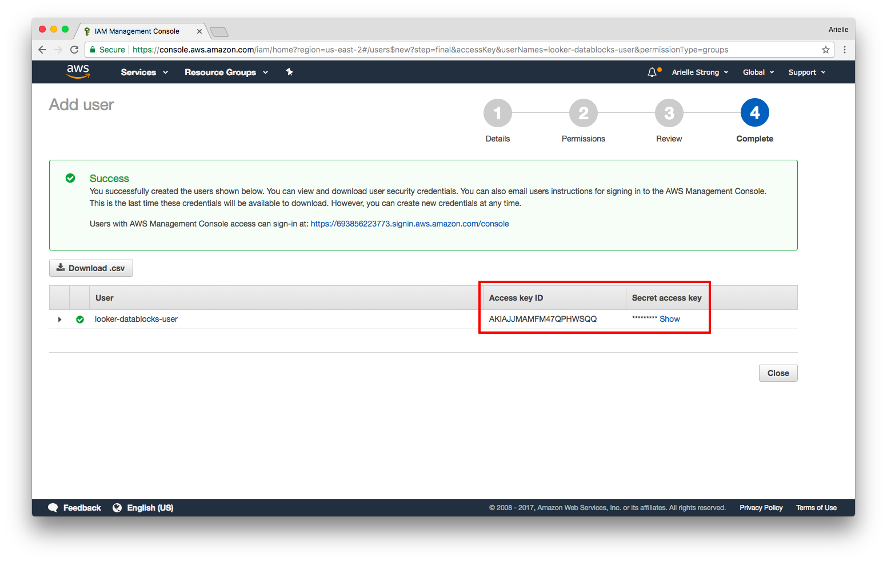

# datablocks-acs-redshift

These instructions are for uploading the ACS dataset into your Redshift database. Note: _if you already have an AWS IAM user with the proper policy you may skip step 1._

**Overall Steps:**
1. In AWS console, apply our policy to your IAM user and grab the IAM access key ID and secret access key (this will be used for the [`copy`](http://docs.aws.amazon.com/redshift/latest/dg/copy-parameters-data-source-s3.html) command in step 4)
2. Create tables in Redshift
3. Copy data to tables from Looker’s S3 bucket
4. Add LookML files to your Looker project

__________________________________________________________________________________________

**Step 1: Add Policy to IAM User and Get Access Key**

If you don't already have an IAM user with an access key and secret access key, you will need to create one in the AWS console. 


Once the user is created, you will be provided with an Access Key ID and Secret Access Key. Write these down for later - the secret key will be shown only once. More information on access keys [here](http://docs.aws.amazon.com/general/latest/gr/aws-sec-cred-types.html#access-keys-and-secret-access-keys). 



Next you will need to add our policy to your IAM user to allow the user to copy data from the Looker S3 bucket. 
You can copy the policy directly from here:
```
{
    "Version": "2012-10-17",
    "Statement": [
        {
            "Sid": "Stmt1507928463000",
            "Effect": "Allow",
            "Action": [
                "s3:GetObject",
                "s3:ListBucket"
            ],
            "Resource": [
                "arn:aws:s3:::looker-datablocks",
                "arn:aws:s3:::looker-datablocks/*"
            ]
        }
    ]
}
```


