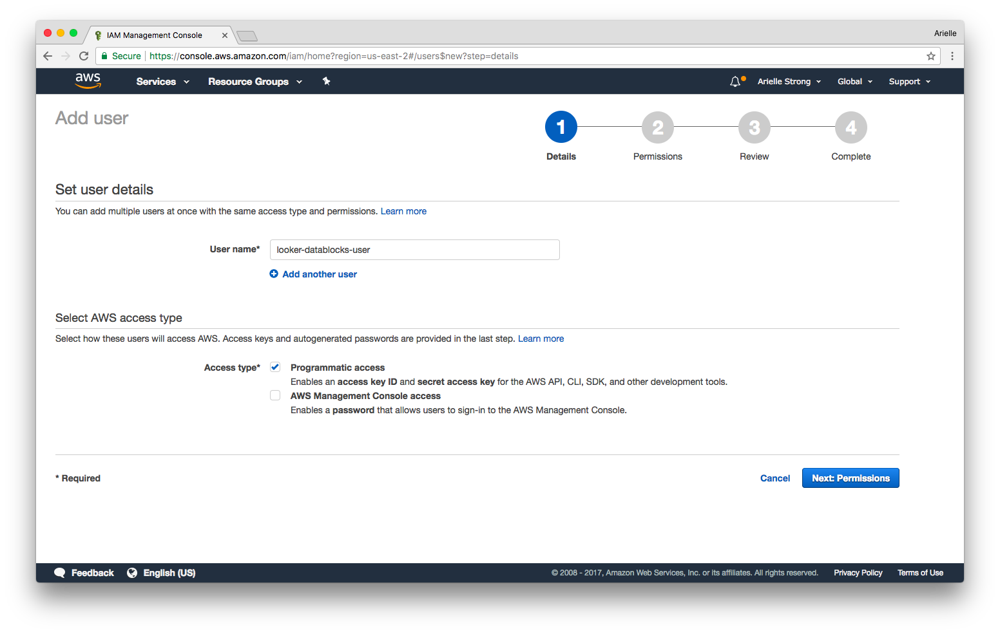
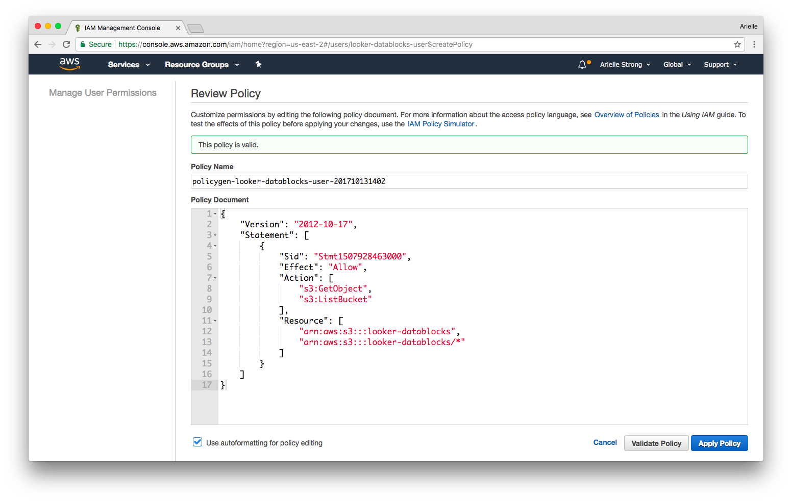

# datablocks-acs-redshift

These instructions are for uploading the ACS dataset into your Redshift database. Note: _if you already have an AWS IAM user with the proper policy you may skip step 1._

### Overall Steps:
1. [(jump)](#step-1-add-policy-to-iam-user-and-get-access-key) In AWS console, apply our policy to your IAM user and grab the IAM access key ID and secret access key (this will be used for the [`copy`](http://docs.aws.amazon.com/redshift/latest/dg/copy-parameters-data-source-s3.html) command in step 3)
2. [(jump)](#step-2-create-tables-in-redshift) Create tables in Redshift
3. [(jump)](#step-3-copy-data-to-redshift-from-lookers-s3-bucket) Copy data to Redshift from Looker’s S3 bucket
4. [(jump)](#step-4-add-lookml-files-to-your-looker-project) Add LookML files to your Looker project

__________________________________________________________________________________________

### Step 1: Add Policy to IAM User and Get Access Key

If you don't already have an IAM user with an access key and secret access key, you will need to create one in the AWS console. 



Once the user is created, you will be provided with an Access Key ID and Secret Access Key. Write these down for later - the secret key will be shown only once. More information on access keys [here](http://docs.aws.amazon.com/general/latest/gr/aws-sec-cred-types.html#access-keys-and-secret-access-keys). 


Next you will need to add our policy to your IAM user to allow the user to copy data from the Looker S3 bucket. 
You can copy the policy directly from here:
```
{
    "Version": "2012-10-17",
    "Statement": [
        {
            "Sid": "Stmt1507928463000",
            "Effect": "Allow",
            "Action": [
                "s3:GetObject",
                "s3:ListBucket"
            ],
            "Resource": [
                "arn:aws:s3:::looker-datablocks",
                "arn:aws:s3:::looker-datablocks/*"
            ]
        }
    ]
}
```





### Step 2: Create Tables in Redshift

Run the following [`create table`](http://docs.aws.amazon.com/redshift/latest/dg/r_CREATE_TABLE_NEW.html) commands in Redshift.

```
CREATE TABLE zcta_distances(
   zip1        INTEGER  PRIMARY KEY
  ,zip2        INTEGER
  ,mi_to_zcta5 NUMERIC(16,13)
);

CREATE TABLE zcta_to_tract_w_state(
   ZCTA5              INTEGER
  ,STATE              VARCHAR(30)
  ,COUNTY             VARCHAR(3)
  ,TRACT              BIGINT
  ,GEOID              BIGINT
  ,POPPT              BIGINT
  ,HUPT               BIGINT
  ,AREAPT             BIGINT
  ,_AREALANDPT        BIGINT
  ,ZPOP               BIGINT
  ,ZHU                BIGINT
  ,ZAREA              BIGINT
  ,ZAREALAND          BIGINT
  ,TRPOP              BIGINT
  ,TRHU               BIGINT
  ,TRAREA             BIGINT
  ,TRAREALAND         BIGINT
  ,ZPOPPCT            NUMERIC(5,2)
  ,ZHUPCT             NUMERIC(5,2)
  ,ZAREAPCT           NUMERIC(5,2)
  ,ZAREALANDPCT       NUMERIC(5,2)
  ,TRPOPPCT           NUMERIC(5,2)
  ,TRHUPCT            NUMERIC(5,2)
  ,TRAREAPCT          NUMERIC(5,2)
  ,TRAREALANDPCT      NUMERIC(5,2)
  ,state_name         VARCHAR(30)
  ,fips               INTEGER
  ,state_abbreviation VARCHAR(2)
);

CREATE TABLE fast_facts(
   logrecno_bg_map_block_group VARCHAR(12) PRIMARY KEY
  ,total_population            INTEGER
  ,housing_units               INTEGER
  ,female                      INTEGER
  ,male                        INTEGER
  ,white_alone_or_in_combo     INTEGER
  ,black_alone_or_in_combo     INTEGER
  ,amind_alone_or_in_combo     INTEGER
  ,asian_alone_or_in_combo     INTEGER
  ,nat_haw_alone_or_in_combo   INTEGER
  ,hispanic_or_latino          INTEGER
  ,white_non_hisp              INTEGER
  ,under_18                    INTEGER
  ,eighteen_to_64              INTEGER
  ,sixty_five_and_over         INTEGER
  ,aggregate_income            INTEGER
);

CREATE TABLE geo2015(
   FILEID    VARCHAR(5) PRIMARY KEY
  ,STUSAB    VARCHAR(2)
  ,SUMLEVEL  INTEGER
  ,COMPONENT VARCHAR(4)
  ,LOGRECNO  INTEGER
  ,US        VARCHAR(30)
  ,REGION    VARCHAR(30)
  ,DIVISION  VARCHAR(30)
  ,STATECE   VARCHAR(30)
  ,STATE     VARCHAR(30)
  ,COUNTY    VARCHAR(30)
  ,COUSUB    VARCHAR(30)
  ,PLACE     VARCHAR(30)
  ,TRACT     VARCHAR(30)
  ,BLKGRP    VARCHAR(30)
  ,CONCIT    VARCHAR(30)
  ,AIANHH    VARCHAR(30)
  ,AIANHHFP  VARCHAR(30)
  ,AIHHTLI   VARCHAR(30)
  ,AITSCE    VARCHAR(30)
  ,AITS      VARCHAR(30)
  ,ANRC      VARCHAR(30)
  ,CBSA      INTEGER
  ,CSA       INTEGER
  ,METDIV    VARCHAR(30)
  ,MACC      VARCHAR(30)
  ,MEMI      VARCHAR(30)
  ,NECTA     VARCHAR(30)
  ,CNECTA    VARCHAR(30)
  ,NECTADIV  VARCHAR(30)
  ,UA        INTEGER
  ,BLANK1    VARCHAR(30)
  ,CDCURR    VARCHAR(30)
  ,SLDU      VARCHAR(30)
  ,SLDL      VARCHAR(30)
  ,BLANK2    VARCHAR(30)
  ,BLANK3    VARCHAR(30)
  ,ZCTA5     INTEGER
  ,SUBMCD    VARCHAR(30)
  ,SDELM     VARCHAR(30)
  ,SDSEC     VARCHAR(30)
  ,SDUNI     VARCHAR(30)
  ,UR        VARCHAR(30)
  ,PCI       VARCHAR(30)
  ,BLANK4    VARCHAR(30)
  ,BLANK5    VARCHAR(30)
  ,PUMA5     VARCHAR(30)
  ,BLANK6    VARCHAR(30)
  ,GEOID     VARCHAR(30)
  ,NAME      VARCHAR
  ,BTTR      VARCHAR(30)
  ,BTBG      VARCHAR(30)
  ,BLANK7    VARCHAR(30)
);

CREATE TABLE block_group_attribs(
   STATEFP      INTEGER
   ,COUNTYFP    INTEGER
   ,TRACTCE     INTEGER
   ,BLKGRPCE    INTEGER
   ,GEOID       BIGINT
   ,NAMELSAD    VARCHAR
   ,MTFCC       VARCHAR
   ,FUNCSTAT    VARCHAR(2)
   ,ALAND       BIGINT
   ,AWATER      BIGINT
   ,INTPTLAT    DECIMAL
   ,INTPTLON    DECIMAL
);
```

### Step 3: Copy Data to Redshift from Looker's S3 Bucket

Run the following [`copy`](http://docs.aws.amazon.com/redshift/latest/dg/copy-parameters-data-source-s3.html) commands in Redshift.
**Note:** _you will need to add your aws_access_key_id and aws_secret_access_key from step 1 into each of the statements_

```
COPY zcta_distances
FROM 's3://looker-datablocks/acs_fast_facts/zcta_distances/' 
CREDENTIALS 'aws_access_key_id=<aws_access_key_id>;aws_secret_access_key=<aws_secret_access_key>'  -- replace with access key and secret key from step 1
REGION 'us-east-1'
IGNOREHEADER as 1
CSV;

COPY zcta_to_tract_w_state
FROM 's3://looker-datablocks/acs_fast_facts/zcta_to_tract_w_state/' 
CREDENTIALS 'aws_access_key_id=<aws_access_key_id>;aws_secret_access_key=<aws_secret_access_key>'  -- replace with access key and secret key from step 1
REGION 'us-east-1'
IGNOREHEADER as 1
CSV;

COPY fast_facts
FROM 's3://looker-datablocks/acs_fast_facts/fast_facts/' 
CREDENTIALS 'aws_access_key_id=<aws_access_key_id>;aws_secret_access_key=<aws_secret_access_key>'  -- replace with access key and secret key from step 1
REGION 'us-east-1'
IGNOREHEADER as 1
CSV;

COPY geo2015
FROM 's3://looker-datablocks/acs_fast_facts/geo_2015/' 
CREDENTIALS 'aws_access_key_id=<aws_access_key_id>;aws_secret_access_key=<aws_secret_access_key>'  -- replace with access key and secret key from step 1
REGION 'us-east-1'
IGNOREHEADER as 1
CSV;

COPY block_group_attribs
FROM 's3://looker-datablocks/acs_fast_facts/block_group_attribs/' 
CREDENTIALS 'aws_access_key_id=<aws_access_key_id>;aws_secret_access_key=<aws_secret_access_key>'  -- replace with access key and secret key from step 1
REGION 'us-east-1'
IGNOREHEADER as 1
CSV;
```

### Step 4: Add LookML Files to your Looker Project

- Copy the LookML files from this repo [(or download here)](https://github.com/llooker/datablocks-acs-redshift/archive/master.zip)
- Add the files to your Looker project (prefixed with `rs`)
- Change the `connection` parameter in the model file to your Redshift connection


Now you're ready to explore ACS data and combine with your other datasets!


